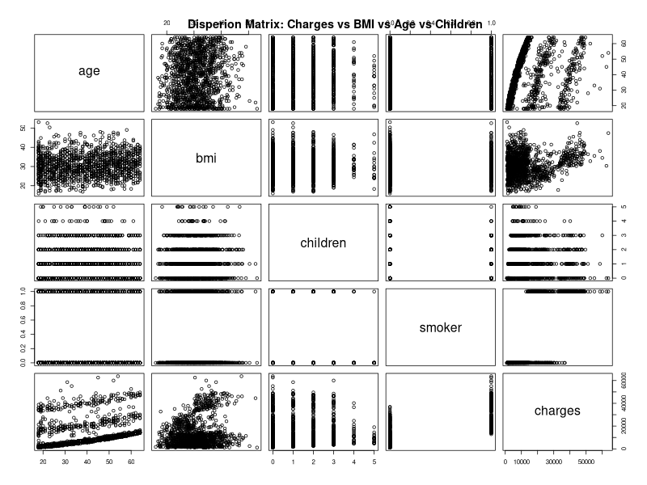

# Modello M_Smoker - Analisi dell'Impatto del Fumo sui Costi Assicurativi

## Obiettivo del Codice

Il file `m_smoker.py` implementa un'**analisi di regressione progressiva** per studiare l'impatto dello **stato di fumatore** sui costi assicurativi sanitari, partendo da un modello semplice e aggiungendo progressivamente altre variabili esplicative. L'analisi utilizza Python con integrazione R tramite la libreria `rpy2`.

### Variabili Analizzate
- **Variabile dipendente (y)**: Charges (costi assicurativi)
- **Variabile principale (x)**: Smoker (stato di fumatore - codificata come binaria: 0=no, 1=yes)
- **Variabili aggiuntive**:
  - **x1**: BMI (Body Mass Index)
  - **x2**: Age (età dell'assicurato)
  - **x3**: Children (numero di figli a carico)

### Modelli di Regressione Implementati
1. **Modello Base**: `charges ~ smoker`
2. **Modello Intermedio**: `charges ~ smoker + bmi + age`
3. **Modello Completo**: `charges ~ smoker + bmi + age + children`

## Dataset

Il dataset `insurance.csv` contiene informazioni su 1338 assicurati. Per questa analisi, la variabile categorica `smoker` (yes/no) è stata trasformata in una variabile binaria numerica (1=fumatore, 0=non fumatore).

## Metodologia

### 1. Preprocessamento dei Dati
- Lettura del dataset `insurance.csv` tramite R
- **Trasformazione della variabile smoker**: da categorica (yes/no) a numerica binaria (1/0)
- Selezione delle variabili per l'analisi progressiva

### 2. Analisi Esplorativa
- **Statistiche descrittive** di tutte le variabili
- **Matrice di correlazione** completa
- **Analisi della distribuzione** delle variabili

### 3. Visualizzazioni Generate
Il codice produce due grafici principali:

#### Scatter Plot: Stato di Fumatore vs Costi Assicurativi


Questo grafico mostra la relazione tra lo stato di fumatore (0=non fumatore, 1=fumatore) e i costi assicurativi:
- La **linea di regressione rossa** evidenzia la forte relazione lineare
- I due gruppi distinti (fumatori vs non fumatori) mostrano differenze marcate nei costi
- La distribuzione dei costi è chiaramente bimodale

#### Matrice di Dispersione Completa


La matrice di dispersione mostra le relazioni tra tutte le variabili del modello completo (charges, BMI, age, children, smoker), permettendo di visualizzare:
- Le distribuzioni individuali di ogni variabile
- Le correlazioni bivariati tra tutte le coppie di variabili
- L'effetto distintivo dello stato di fumatore rispetto alle altre variabili continue

### 4. Analisi di Regressione Progressiva
- **Modello 1**: Solo variabile smoker
- **Modello 2**: Aggiunta di BMI e età
- **Modello 3**: Aggiunta del numero di figli
- Confronto delle performance tra i modelli

## Risultati Dettagliati

### Statistical Summary of Variables
```
       y               x                x1              x2       
 Min.   : 1122   Min.   :0.0000   Min.   :15.96   Min.   :18.00  
 1st Qu.: 4740   1st Qu.:0.0000   1st Qu.:26.30   1st Qu.:27.00  
 Median : 9382   Median :0.0000   Median :30.40   Median :39.00  
 Mean   :13270   Mean   :0.2048   Mean   :30.66   Mean   :39.21  
 3rd Qu.:16640   3rd Qu.:0.0000   3rd Qu.:34.69   3rd Qu.:51.00  
 Max.   :63770   Max.   :1.0000   Max.   :53.13   Max.   :64.00  
       x3       
 Min.   :0.000  
 1st Qu.:0.000  
 Median :1.000  
 Mean   :1.095  
 3rd Qu.:2.000  
 Max.   :5.000  
```

**Interpretazione delle Statistiche Descrittive:**
- **Charges (y)**: Invariate rispetto ai modelli precedenti ($1,122 - $63,770, media $13,270)
- **Smoker (x)**: 20.48% del campione sono fumatori (media = 0.2048)
- **BMI, Age, Children**: Distribuzioni invariate rispetto alle analisi precedenti

### Correlation Index between Variables
```
            y            x          x1          x2         x3
y  1.00000000  0.787251430 0.198340969  0.29900819 0.06799823
x  0.78725143  1.000000000 0.003750426 -0.02501875 0.00767312
x1 0.19834097  0.003750426 1.000000000  0.10927188 0.01275890
x2 0.29900819 -0.025018752 0.109271882  1.00000000 0.04246900
x3 0.06799823  0.007673120 0.012758901  0.04246900 1.00000000
```

**Analisi della Matrice di Correlazione:**
- **Charges vs Smoker**: r = 0.787 (**correlazione molto forte**, la più alta tra tutte le variabili)
- **Smoker vs altre variabili**: Correlazioni molto basse (< 0.03), indicando **indipendenza** dello stato di fumatore dalle altre caratteristiche demografiche
- Questa indipendenza è cruciale per evitare problemi di multicollinearità nei modelli multivariati

## Analisi dei Modelli Progressivi

### Modello 1: Solo Variabile Smoker

```
Call:
lm(formula = y ~ x)

Residuals:
   Min     1Q Median     3Q    Max 
-19221  -5042   -919   3705  31720 

Coefficients:
            Estimate Std. Error t value Pr(>|t|)    
(Intercept)   8434.3      229.0   36.83   <2e-16 ***
x            23616.0      506.1   46.66   <2e-16 ***
---
Signif. codes:  0 '***' 0.001 '**' 0.01 '*' 0.05 '.' 0.1 ' ' 1

Residual standard error: 7470 on 1336 degrees of freedom
Multiple R-squared:  0.6198,    Adjusted R-squared:  0.6195 
F-statistic:  2178 on 1 and 1336 DF,  p-value: < 2.2e-16
```

**Risultati del Modello Base:**
- **Equazione**: charges = 8434.3 + 23616.0 × smoker
- **R-squared**: 61.98% (capacità predittiva eccellente)
- **Interpretazione**: I fumatori pagano in media $23,616 in più rispetto ai non fumatori
- **Costo base non fumatori**: $8,434
- **Costo medio fumatori**: $8,434 + $23,616 = $32,050

### Modello 2: Smoker + BMI + Age

```
Call:
lm(formula = y ~ x + x1 + x2)

Residuals:
     Min       1Q   Median       3Q      Max 
-12415.4  -2970.9   -980.5   1480.0  28971.8 

Coefficients:
             Estimate Std. Error t value Pr(>|t|)    
(Intercept) -11676.83     937.57  -12.45   <2e-16 ***
x            23823.68     412.87   57.70   <2e-16 ***
x1             322.62      27.49   11.74   <2e-16 ***
x2             259.55      11.93   21.75   <2e-16 ***
---
Signif. codes:  0 '***' 0.001 '**' 0.01 '*' 0.05 '.' 0.1 ' ' 1

Residual standard error: 6092 on 1334 degrees of freedom
Multiple R-squared:  0.7475,    Adjusted R-squared:  0.7469 
F-statistic:  1316 on 3 and 1334 DF,  p-value: < 2.2e-16
```

**Miglioramenti del Modello Intermedio:**
- **R-squared**: 74.75% (miglioramento del 12.77% rispetto al modello base)
- **Errore Standard**: 6,092 (miglioramento da 7,470)
- **Coefficiente Smoker**: $23,824 (stabile rispetto al modello base)
- **Tutti i coefficienti altamente significativi**

### Modello 3: Modello Completo (Smoker + BMI + Age + Children)

```
Call:
lm(formula = y ~ x + x1 + x2 + x3)

Residuals:
     Min       1Q   Median       3Q      Max 
-11897.9  -2920.8   -986.6   1392.2  29509.6 

Coefficients:
             Estimate Std. Error t value Pr(>|t|)    
(Intercept) -12102.77     941.98 -12.848  < 2e-16 ***
x            23811.40     411.22  57.904  < 2e-16 ***
x1             321.85      27.38  11.756  < 2e-16 ***
x2             257.85      11.90  21.675  < 2e-16 ***
x3             473.50     137.79   3.436 0.000608 ***
---
Signif. codes:  0 '***' 0.001 '**' 0.01 '*' 0.05 '.' 0.1 ' ' 1

Residual standard error: 6068 on 1333 degrees of freedom
Multiple R-squared:  0.7497,    Adjusted R-squared:  0.7489 
F-statistic: 998.1 on 4 and 1333 DF,  p-value: < 2.2e-16
```

## Risultati Principali

### Equazione del Modello Completo
**charges = -12102.77 + 23811.40×Smoker + 321.85×BMI + 257.85×Age + 473.50×Children**

### Interpretazione Dettagliata dei Coefficienti (Modello Completo)

#### Intercetta (-12102.77)
- **Valore**: -$12,102.77
- **Interpretazione**: Costo base teorico per un non fumatore con BMI=0, età=0 e figli=0

#### Coefficiente Smoker (23811.40)
- **Valore**: $23,811.40
- **t-value**: 57.904 (il più alto di tutti i coefficienti)
- **Interpretazione**: **Essere fumatore comporta un aumento medio di $23,811 nei costi assicurativi, tenendo costanti tutte le altre variabili**

#### Coefficiente BMI (321.85)
- **Valore**: $321.85 per unità di BMI
- **Interpretazione**: Ogni aumento di 1 unità di BMI comporta un aumento di $322 nei costi

#### Coefficiente Age (257.85)
- **Valore**: $257.85 per anno di età
- **Interpretazione**: Ogni anno di età comporta un aumento di $258 nei costi

#### Coefficiente Children (473.50)
- **Valore**: $473.50 per figlio
- **Interpretazione**: Ogni figlio aggiuntivo comporta un aumento di $474 nei costi

## Confronto tra i Modelli

| Modello | Variabili | R² | R² Adj | Errore Std | F-statistic |
|---------|-----------|----|---------|-----------| ------------|
| **M1** | Smoker | 61.98% | 61.95% | 7,470 | 2,178 |
| **M2** | Smoker + BMI + Age | 74.75% | 74.69% | 6,092 | 1,316 |
| **M3** | Smoker + BMI + Age + Children | 74.97% | 74.89% | 6,068 | 998.1 |

### Osservazioni sui Miglioramenti
1. **Salto più significativo**: Da M1 a M2 (+12.77% di R²)
2. **Miglioramento marginale**: Da M2 a M3 (+0.22% di R²)
3. **Stabilità del coefficiente Smoker**: Rimane sostanzialmente invariato (~$23,800) in tutti i modelli
4. **Efficienza crescente**: Errore standard in continua diminuzione

## Confronto con i Modelli Precedenti (M1 e M2)

### Superiority del Modello M_Smoker
- **M1 (solo BMI)**: R² = 3.93%
- **M2 (BMI + Age + Children)**: R² = 12.01%
- **M_Smoker (completo)**: R² = 74.97%

**Il modello con smoker spiega oltre 6 volte più varianza rispetto al miglior modello precedente (M2).**

### Impatto sui Coefficienti delle Altre Variabili
- **BMI**: Da $393.87 (M1) a $332.08 (M2) a $321.85 (M_Smoker)
- **Age**: Da $239.99 (M2) a $257.85 (M_Smoker)
- **Children**: Da $542.86 (M2) a $473.50 (M_Smoker)

## Limitazioni e Osservazioni

1. **Dominio della Variabile Smoker**: Lo stato di fumatore è di gran lunga il predittore più importante
2. **Distribuzioni Residue**: Miglioramento significativo ma presenza di outliers ancora rilevanti
3. **Linearità**: Il modello assume relazioni lineari che si dimostrano appropriate per questa analisi
4. **Variabili Omesse**: Il 25% di varianza non spiegata indica altri fattori non inclusi (es. condizioni preesistenti, regione geografica)

## Conclusioni

Il **Modello M_Smoker** rappresenta un breakthrough nell'analisi dei costi assicurativi:

### Risultati Chiave
- **Lo stato di fumatore è il fattore dominante** nella determinazione dei costi assicurativi
- **Capacità predittiva eccellente**: 74.97% di varianza spiegata
- **Tutti i predittori sono altamente significativi**
- **Robustezza del modello**: Coefficienti stabili e interpretazione economica chiara

### Implicazioni Pratiche per le Assicurazioni
- **Segmentazione dei rischi**: I fumatori rappresentano una categoria di rischio nettamente superiore
- **Pricing differenziato**: La differenza di $23,811 giustifica premi assicurativi significativamente diversi
- **Fattori aggiuntivi**: BMI, età e numero di figli mantengono comunque un impatto economico rilevante

### Rilevanza Scientifica
- **Conferma empirica**: I risultati confermano scientificamente l'impatto devastante del fumo sui costi sanitari
- **Modello di riferimento**: Stabilisce un benchmark per future analisi nel settore assicurativo sanitario
- **Base per sviluppi**: Fornisce una solida base per modelli più complessi che includano interazioni e effetti non lineari

Il **Modello M_Smoker** dimostra definitivamente che lo stato di fumatore è il singolo fattore più importante nella determinazione dei costi assicurativi sanitari, superando di gran lunga l'importanza di età, BMI e altre caratteristiche demografiche.